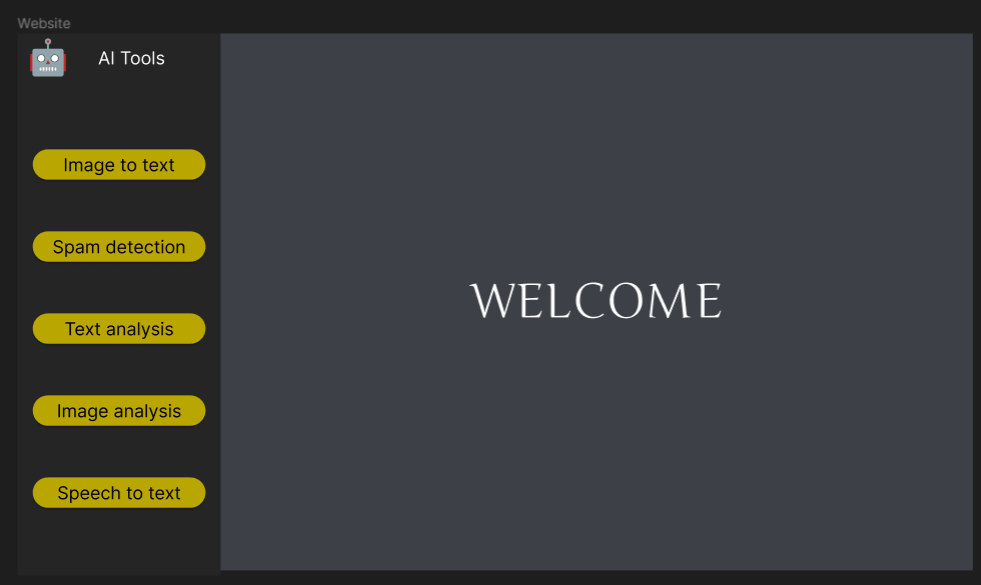
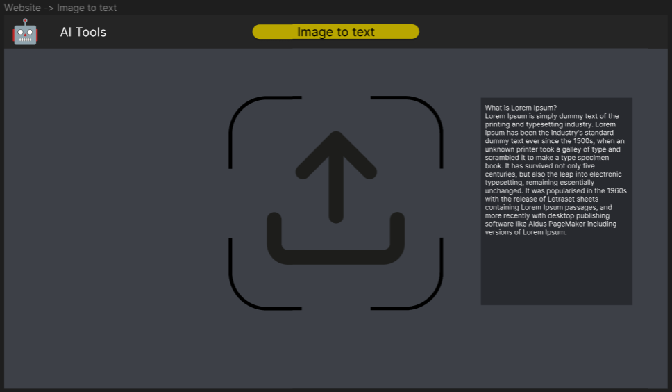
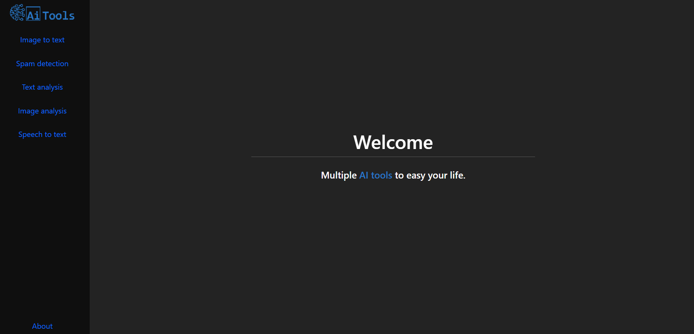
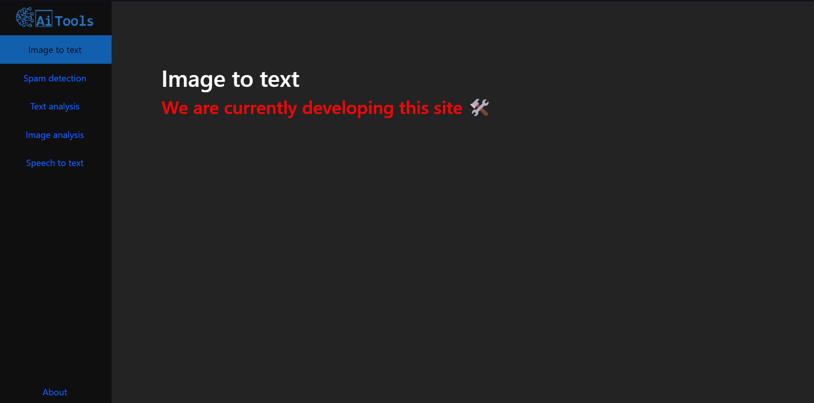

# Advanced python project

> Welcome to our website where you can use of the tools with AI behind them such as (we are planning to add them):
>  * Get text from image (TBD)
>  * Spam detection (TBD)
>  * Text analysis (TBD)
>  * Image analysis (TBD)
>  * Speech to text (TBD)
>  
 
>  Check it! [Link to website]  
>  Enjoy!

## Content

- [Advanced python project](#advanced-python-project)
  - [Content](#content)
  - [General info](#general-info)
  - [For developers](#for-developers)
  - [Screenshots](#screenshots)
  - [Technologies](#technologies)
  - [Features](#features)
  - [Status](#status)
  - [Our team!](#our-team)

## General info

This is our academic project for "Advanced programming in Python" classes.  
The main goal is to make REST API with endpoints containing some machine learning ideas.

## For developers

**Requiers** ***Docker***

1. Download repository
2. Unzip archive to known location
3. Open terminal
4. Move to project location (or open terminal in it) e.g. <code>cd C:\Users\\[YOUR_USERNAME]\Downloads\advanced-python-project-master</code>
5. Run using: <code>docker-compose up -d --build</code>
6. Open: <code>http://localhost:7000/</code>
## Screenshots

[comment]: 

Concept:  
  
  

Developing version 1:  
  
  

Developing version 2:  
  

## Technologies

Front-end:
* HTML v TBD
* Bootstrap v TBD
* CSS v TBD

Back-end:
* Python v 3.X
* FastAPI v TBD

Cloud:
* GitHub

## Features

TBD

## Status

Project status: _in preparing_

That means we are planning what to do and how we do it.

## Our team!

* [Jacek Jendrzejewski](https://jacekjen.byst.re) (back-end developer)
* [Maciej Baranowski](https://github.com/SonnyFixit) (back-end developer)
